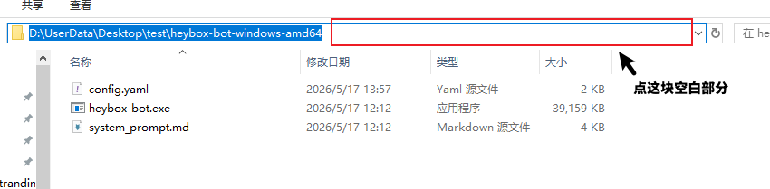
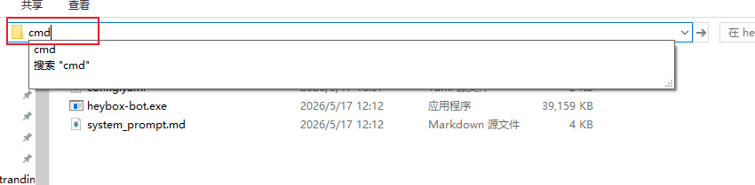

# 配置说明

项目启动时会读取根目录下的 `config.yaml`，如果配置不正确会导致无法启动，具体原因可以查看日志文件。

出于安全考虑，LLM 的 API Key 建议通过环境变量配置，不建议明文写入
`config.yaml`。当然如果你不在意安全，明文写入配置文件也能生效。下面是配置环境变量的方法：

> `IMAGE_API_KEY` 只有在 `llm.extra_image_llm: true` 时才是必需项。

- Linux/MacOS 配置环境变量：

```bash
export API_KEY="你的聊天模型 API Key"
export IMAGE_API_KEY="你的图片模型 API Key"
```

- Windows 配置环境变量

请参考：[Windows如何配置环境变量](https://zhuanlan.zhihu.com/p/646247339)

如果能用的是vscode，请在配置完环境变量后重启vscode，否则配置可能不生效。可以用如下指令检查是否配置成功：
```cmd
# 命令提示符cmd:
echo %API_KEY%
echo %IMAGE_API_KEY%

# powershell:
echo $env:API_KEY
echo $env:IMAGE_API_KEY
```
如果配置成功，以上命令会输出你配置的环境变量。注意，用来检查是否生效的终端也需要在配置完环境变量后重启


## 1. 完整示例

```yaml
log:
  path: "log/"
  level: "INFO"
  max_day: 7

bot:
  mode: "white_list"
  init_wait_time: 10
  max_wait_time: 120
  max_post_image_num: 3
  max_comment_image_num: 3
  white_list: [123456, 234567]
  frequency: 3

llm:
  support_image: true
  extra_image_llm: true
  chat:
    vendor: "deepseek"
    base_url: "https://api.deepseek.com/"
    model: "deepseek-v4-flash"
  image:
    vendor: "kimi"
    base_url: "https://api.moonshot.cn/v1"
    model: "kimi-k2.6"
```

## 2. log

| 配置项 | 类型 | 默认值 | 说明 |
| --- | --- | --- | --- |
| `log.path` | string | `log/` | 日志输出目录。通常不需要修改。 |
| `log.level` | string | `INFO` | 日志等级，常用值为 `DEBUG`、`INFO`、`WARN`、`ERROR`、`FATAL`。 |
| `log.max_day` | int | `7` | 日志文件保留天数。超过天数的日志文件会被自动删除。 |

## 3. bot

| 配置项 | 类型 | 默认值 | 说明 |
| --- | --- | --- | --- |
| `bot.mode` | string | 无 | 机器人服务模式。必填，可选 `white_list` 或 `frequency`。 |
| `bot.init_wait_time` | int | `10` | 消息轮询的初始等待秒数，必须大于 `0`。 |
| `bot.max_wait_time` | int | `120` | 消息轮询的最大等待秒数，必须大于 `0`，且不能小于 `bot.init_wait_time`。 |
| `bot.max_post_image_num` | int | `3` | 整理未读消息时最多保留的帖子图片数量，不能小于 `0`。 |
| `bot.max_comment_image_num` | int | `3` | 整理未读消息时最多保留的评论图片数量，不能小于 `0`。 |
| `bot.white_list` | int[] | `[]` | 允许服务的用户 ID 列表，仅在 `white_list` 模式下生效。 |
| `bot.frequency` | int | `3` | 每个用户一分钟内最多调用次数，仅在 `frequency` 模式下生效，必须大于 `0`。 |

### 3.1 white_list 模式

`white_list` 模式只响应白名单中的用户。此模式下 `bot.white_list` 不能为空。

```yaml
bot:
  mode: "white_list"
  white_list: [123456, 234567]
```

### 3.2 frequency 模式

`frequency` 模式允许所有用户调用，但是会限制调用频率。此模式下 `bot.frequency` 必须大于
`0`。

```yaml
bot:
  mode: "frequency"
  frequency: 3
```

## 4. llm

| 配置项 | 类型 | 默认值 | 说明 |
| --- | --- | --- | --- |
| `llm.support_image` | bool | `true` | 是否允许聊天模型接收图片输入 |
| `llm.extra_image_llm` | bool | `false` | 是否为图片理解单独配置一个模型。为 `false` 时复用 `llm.chat` 配置 |

### 4.1 聊天模型配置

| 配置项 | 类型 | 默认值 | 说明 |
| --- | --- | --- | --- |
| `llm.chat.vendor` | string | `openai` | 聊天模型供应商，具体见下文 |
| `llm.chat.base_url` | string | 无 | 聊天模型 API Base URL，必填 |
| `llm.chat.model` | string | 无 | 聊天模型名称，必填 |
| `llm.chat.api_key` | string | 环境变量 `API_KEY` | 聊天模型 API Key，必填。建议使用环境变量 |

### 4.2 图片模型配置

以下 `llm.image` 配置仅在 `llm.extra_image_llm: true` 时必填。

| 配置项 | 类型 | 默认值 | 说明 |
| --- | --- | --- | --- |
| `llm.image.vendor` | string | `openai` | 图片模型供应商，具体见下文 |
| `llm.image.base_url` | string | 无 | 图片模型 API Base URL |
| `llm.image.model` | string | 无 | 图片模型名称 |
| `llm.image.api_key` | string | 环境变量 `IMAGE_API_KEY` | 图片模型 API Key。建议使用环境变量 |

### 4.3 base url 填写注意事项
各大厂商的api文档中，一般会有 `curl` 和 `python` 的调用示例，这两个调用示例用的 base url 一般不一样。填写配置时，**请填入 `python` 示例的 base url**。

以小米的mimo api文档为例，文档中，`curl` 调用示例：
```bash
# openai api兼容
curl --location --request POST 'https://api.xiaomimimo.com/v1/chat/completions' \
--header "api-key: $MIMO_API_KEY" \
# ......

# anthropic api 兼容
curl --location --request POST 'https://api.xiaomimimo.com/anthropic/v1/messages' \
--header "api-key: $MIMO_API_KEY" \
# ......
```
`python` 调用示例：
```python
# openai api兼容
import os
from openai import OpenAI

client = OpenAI(
    api_key=os.environ.get("MIMO_API_KEY"),
    base_url="https://api.xiaomimimo.com/v1"
)
# ......

# anthropic api 兼容
import os
from anthropic import Anthropic

client = Anthropic(
    api_key=os.environ.get("MIMO_API_KEY"),
    base_url="https://api.xiaomimimo.com/anthropic"
)
# ......
```

base url 应该填 `https://api.xiaomimimo.com/v1`（openai兼容） 或 `https://api.xiaomimimo.com/anthropic`（anthropic兼容），而不是 `curl` 示例中带有 `/chat/completions` 或 `/v1/messages` 后缀的url。

### 4.4 供应商
`llm.chat.vendor` 和 `llm.image.verndor` 目前支持的值有（不区分大小写）：

1. `openai`：openai的api，非openai官方但是兼容openai api的，请直接填 `""`（留空）
2. `anthropic`/`claude`：anthropic api
3. `deepseek`: deepseek api，用openai的baseurl或anthropic格式的url都行
4. `kimi`/`moonshot`：kimi api
5. `volcengine`/`volcano`/`ark`：字节火山引擎
6. `mimo`:：小米mimo api，用openai的baseurl或anthropic格式的url都行
7. 其他值或不填：默认按openai兼容调用 `/chat/completions` 接口，请确保供应商的api兼容openai格式

### 4.5 单模型配置

如果你有一个多模态的模型，可以只配置 `llm.chat`，并保持
`llm.extra_image_llm: false`。

```yaml
llm:
  support_image: true
  extra_image_llm: false
  chat:
    vendor: "openai"
    base_url: "https://api.openai.com/v1"
    model: "gpt-4.1-mini"
```

如果你只有一个纯文本模型，请把 `llm.support_image` 设为 `false`

### 4.6 独立多模态模型配置

如果希望图片处理使用另一个模型，将 `llm.extra_image_llm` 设为 `true`，并补全
`llm.image` 配置。

```yaml
llm:
  support_image: true
  extra_image_llm: true
  chat:
    vendor: "openai"
    base_url: "https://api.openai.com/v1"
    model: "gpt-4.1-mini"
  image:
    vendor: "openai"
    base_url: "https://api.openai.com/v1"
    model: "gpt-4.1-mini"
```

### 4.7 检查配置

填写完成后可以执行以下命令验证AI配置（和其他配置）是否正确：
- Linux/MacOS：
```bash
./heybox-bot --llm_test
```
- Windows:
1. 在文件资源管理器打开解压后的文件夹，点击文件夹路径后面的空白部分：

2. 输出cmd并按回车：

3. 在弹出的命令提示符窗口中执行：
```cmd
.\heybox-bot.exe --llm_test
```
如果输出结果不正确，请根据输出修改配置

## 5. 热更新

程序启动后会监听 `config.yaml` 的变化。配置文件修改并保存后，如果新配置校验通过，
程序会自动切换到新配置；如果校验失败，会继续使用上一版有效配置，并在日志中记录错误。

如果能确保配置写入的是正确值，但还是更新失败，可以试试多按几次 `ctrl-s` 保存。

注意：环境变量通常在进程启动时确定。修改 `API_KEY` 或 `IMAGE_API_KEY` 后，建议重启
程序。

## 6. 启动失败排查

以下配置会导致启动或热更新失败：

- `bot.mode` 不是 `white_list` 或 `frequency`
- `white_list` 模式下 `bot.white_list` 为空
- `frequency` 模式下 `bot.frequency` 小于等于 `0`
- `bot.init_wait_time` 或 `bot.max_wait_time` 小于等于 `0`
- `bot.max_wait_time` 小于 `bot.init_wait_time`
- `bot.max_post_image_num` 或 `bot.max_comment_image_num` 小于 `0`
- `llm.chat.base_url`、`llm.chat.model` 或 `API_KEY` 为空
- `llm.extra_image_llm: true` 时，`llm.image.base_url`、`llm.image.model` 或 `IMAGE_API_KEY` 为空

具体请查看日志文件
